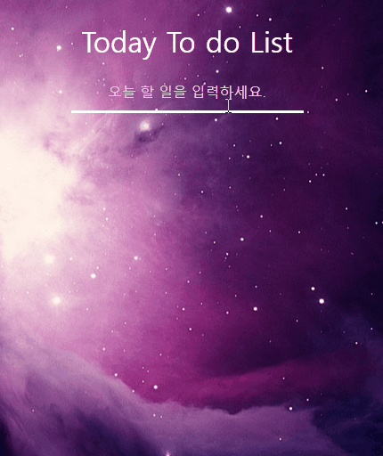

## 구현 기능

1. 이름 설정 및 변경 기능
1. 현재 날짜
1. 현재 좌표(지역)의 날씨
1. 실시간 시계
1. 시간에 알맞는 인사
1. To do List (커스텀 스크롤, 목록 추가/삭제 기능)
1. 배경화면 클릭시 화면 전환

<br>

## src 디렉터리 구조

```
images : 이미지 파일 집합
components : 재사용 가능한 컴포넌트 집합
template : 페이지를 만들 수 있도록 컴포넌트/레이아웃 주입
pages : 유저가 보는 실제 콘텐츠

📦src
┣ 📂components
┃  ┣ 📂Clock
┃  ┣ 📂CurrentDate
┃  ┣ 📂ToDoList
┃  ┣ 📂UserNameInput
┃  ┗ 📂Weather
┣ 📂images
┣ 📂pages
┃  ┗ 📂Home
┗ 📂template
   ┣ 📂Header
   ┗ 📂Main
```

<br>

## 결과화면
<center>
  
  
</center>
